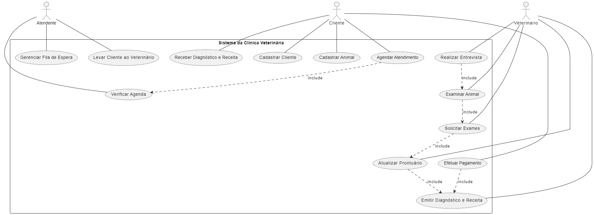

# kledyson_ferraz
# 1 - Descrição do sistema da clinica veterinária:
Exercício 1:

1.	Uma clínica veterinária atende apenas os animais: gatos e cachorros. 
2.	Os clientes devem fazer um cadastro de si e dos animais. 
3.	Os clientes devem informar as condições nas quais os animais chegam. 
4.	Os clientes devem informar o tipo de ração que o animal come. 
5.	O cliente deve informar hábitos do animal. 
6.	Para cada animal é possível que mais de um veterinário o atenda. 
7.	Os animais podem chegar e serem atendidos de acordo com uma agenda do dia. 
8.	Cada animal atendido receberá uma ficha e um prontuário. 
9.	Outros donos podem querer marcar horários de atendimento futuro. 
10.	O atendimento gera uma receita para o animal. 
11.	Quando um cliente chega na clínica veterinária ele é atendido por um atendente. 
12.	O atendente deve verificar se existe agenda disponível com um veterinário. 
13.	O atendente deve colocar o cliente e seu animal na fila de espera, se for o caso. 
14.	O atendente deve levar o cliente e o animal até o veterinário. 
15.	O veterinário deve realizar uma entrevista com o dono do animal. 
16.	O resultado da entrevista deve ir para um formulário. 
17.	O veterinário deverá examinar o animal e anotar em prontuário(ficha) suas observações. 
18.	Dependendo da situação do animal este receberá uma receita.
19.	Os exames devem ser registrados no prontuário do animal e uma ordem de serviço deve ser gerada.
20.	O cliente deve ser informado sobre os exames
21.	Após a realização dos exames, os resultados devem ser anexados ao prontuário do animal
22.	Com base nos resultados dos exames, o veterinário pode atualizar o diagnóstico e a receita
23.	O cliente deve ser informado sobre o diagnóstico final, o tratamento recomendado e os próximos passos a serem seguidos
24.	O pagamento pelos serviços prestados deve ser registrado, e um recibo deve ser emitido ao cliente.

# 2 - Diagrama do banco de dados:
```mermaid
erDiagram
    CLIENTES {
        int id_cliente PK
        varchar nome
        varchar endereco
        varchar telefone
        varchar email
        date data_registro
    }
    
    ANIMAIS {
        int id_animal PK
        varchar nome
        enum especie
        varchar raca
        int idade
        enum sexo
        varchar condicoes
        varchar tipo_racao
        text habitos
        int id_cliente FK
    }
    
    VETERINARIOS {
        int id_veterinario PK
        varchar nome
        varchar especialidade
        varchar telefone
        varchar email
    }
    
    AGENDAMENTOS {
        int id_agendamento PK
        int id_animal FK
        int id_veterinario FK
        datetime data_agendamento
        enum status
    }
    
    PRONTUARIOS {
        int id_prontuario PK
        int id_animal FK
        int id_veterinario FK
        datetime data_atendimento
        text observacoes
        text receita
    }
    
    EXAMES {
        int id_exame PK
        int id_prontuario FK
        varchar descricao
        text resultado
        date data_exame
    }
    
    ATENDENTES {
        int id_atendente PK
        varchar nome
        varchar telefone
        varchar email
    }
    
    PAGAMENTOS {
        int id_pagamento PK
        int id_agendamento FK
        date data_pagamento
        decimal valor_pago
        enum metodo_pagamento
    }
    
    CLIENTES ||--o{ ANIMAIS : "Possui"
    ANIMAIS ||--o{ AGENDAMENTOS : "Agendado para"
    VETERINARIOS ||--o{ AGENDAMENTOS : "Atende"
    ANIMAIS ||--o{ PRONTUARIOS : "Possui"
    VETERINARIOS ||--o{ PRONTUARIOS : "Preenche"
    PRONTUARIOS ||--o{ EXAMES : "Gera"
    AGENDAMENTOS ||--o{ PAGAMENTOS : "Relaciona-se com"
````

# 3 - Diagrama de casos de uso:



# 4 - Principais Telas do Sistema:

# 5 - Arquitetura do Sistema: